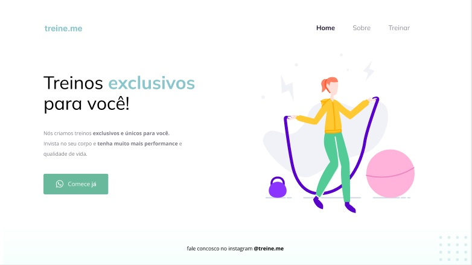

<h1 align="center"> Corrigindo Bugs: Treine me </h1>

Neste desafio recebemos o codigo modificado do layout que desenvolvemos durante as aulas do curso Explorer da Rocketseat, com a intenção de corrirgmos os bugs e deixar a aplicação correta.  

  <a href="#-tecnologias">Tecnologias</a>&nbsp;&nbsp;&nbsp;|&nbsp;&nbsp;&nbsp;
  <a href="#-projeto">Projeto</a>

  

## 🚀 Tecnologias

Esse projeto foi desenvolvido com as seguintes tecnologias:

- HTML
- CSS
- Git e Github
- Figma

## 💻 Projeto

- [Visite o projeto online](https://pedrohfaig.github.io/Traineme)

---

Feito por Pedro Henrique Faig